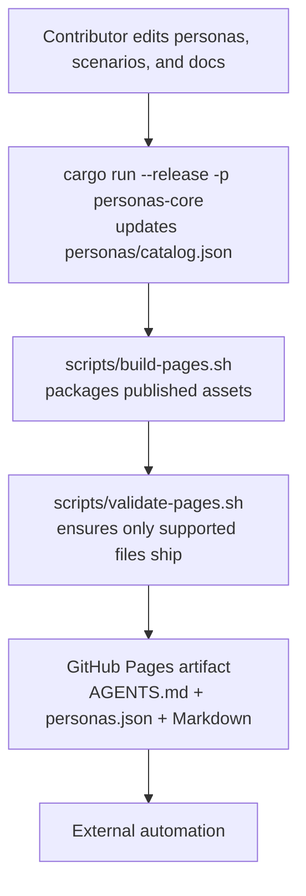

# Codex Tools


## Shared Guidance

Key shared guidance lives in:
- `AGENTS.md` for the always-on baseline
- `docs/AGENT_ENTRYPOINT.md` for agent bootstrapping and tool selection
- `docs/PROMPT_GENERATION.md` for context-efficient planner-to-executor prompt generation

This repository hosts behavioral **personas** for Codex agents. Personas are Markdown prompts with YAML front matter that describe specialized roles. The collection is published read-only through GitHub Pages for direct consumption by automation and other integrations.

## Persona Usage Guidelines

- Always select a persona before starting work on a task so the agent operates from a clear perspective.
- Switch personas explicitly when the task changes focus and document the active persona in status updates.
- Align tooling and communication with the currently selected persona to keep expectations consistent for collaborators.

### Catalog Audit Findings

- **Architect vs. Tech Lead** duplicated responsibilities around technical direction, reviews, and mentoring; the Tech Lead persona was merged into the refreshed Solution Architect profile.
- **DevOps vs. Security** overlapped on pipeline hardening and controls without a clear separation of duties; the refreshed DevOps Engineer now focuses on CI/CD efficiency, caching, and supply-chain guardrails, while the Reliability & Security Engineer retains broader operational resilience.
- **Senior Developer vs. Tech Lead** both focused on hands-on delivery with minimal differentiation; the Delivery Engineer persona now represents the shared implementation scope.
- **Missing operational continuity** — no single persona previously owned resiliency, compliance, and incident readiness; the new Reliability & Security Engineer fills that scenario.

### Core Persona Set (2025 Refresh)

| Persona | When to Use | Key Artifacts |
| --- | --- | --- |
| **Discovery Analyst** | Early discovery, backlog clarification, stakeholder alignment | Discovery brief, prioritized backlog, risk register |
| **Solution Architect** | Translating validated scope into technical plans | Mermaid diagrams, technical decision records, interface checklists |
| **Delivery Engineer** | Building and shipping production Rust changes | Implementation plan, PR checklist, post-merge notes |
| **Quality Engineer** | Designing coverage and enforcing release readiness | Test strategy, automation backlog, release quality checklist |
| **DevOps Engineer** | Optimizing CI/CD efficiency, caching, and supply-chain security | CI/CD performance baseline, cache strategy, pipeline security checklist |
| **Reliability & Security Engineer** | Hardening operations, compliance, and incident response | Operational readiness checklist, security review log, incident plan |

Each persona file in [`/personas/`](personas/) contains:

1. **Responsibilities checklist** — required activities before the persona considers the task complete.
2. **Switch triggers** — guidance on when to hand off to another persona as the work evolves.
3. **Required artifacts** — tangible outputs to produce and share during handover.

### Switching Playbook

1. Start in the persona whose responsibilities match the current blocker.
2. Review the "When to Switch Away" list to proactively identify the next handoff.
3. Produce the listed artifacts before switching personas to keep context intact.
4. Announce the persona change in status updates and share the prepared artifacts with the incoming persona.

## Scenario Library

Reusable task playbooks live in [`/scenarios/`](scenarios/) alongside personas and are published through GitHub Pages as Markdown prompts. Clients can discover them via the catalog at `https://qqrm.github.io/codex-tools/scenarios.json` and retrieve each scenario from `/scenarios/{id}.md`. When a user explicitly asks to run a named scenario—such as an architecture audit or dependency refresh—load the scenario prompt and combine it with the active persona to guide execution.

## Remote Setup

Configure the Git remote if it is missing:

```bash
git remote add origin https://github.com/qqrm/codex-tools.git
git fetch origin
```

### Container bootstrap commands

Three published entry points cover the common Codex container workflows. Each snippet downloads the script from the GitHub Pages deployment and executes it directly:

> **Note:** The scripts refresh shared instructions from GitHub Pages before running. Override the download origin by exporting `PAGES_BASE_URL` when testing mirrors or forks.

> **Bundle layout:** The published artifact exposes only the three entry-point scripts under `/scripts/`. Each helper is self-contained and interacts with repository-local tooling when available.

#### Non-cached container — full initialization
- Downloads the latest `AGENTS.md` from GitHub Pages to prime the workspace
- Performs the same tooling setup as the cached workflow on a brand new container
- Stores GitHub authentication, validates repository access, and installs the cleanup workflow

```bash
curl -fsSL "https://qqrm.github.io/codex-tools/scripts/FullInitialization.sh" | bash -s --
```

#### Cached container — full initialization
- Installs GitHub CLI, Rust, cargo-binstall, and helper tooling
- Persists GitHub authentication for later reuse inside the cached image
- Verifies repository access and installs the Codex cleanup workflow once

```bash
curl -fsSL "https://qqrm.github.io/codex-tools/scripts/BaseInitialization.sh" | bash -s --
```

#### Cached container — lightweight refresh before a task
- Updates the workspace copy of `AGENTS.md` from GitHub Pages

```bash
curl -fsSL "https://qqrm.github.io/codex-tools/scripts/PretaskInitialization.sh" | bash -s --
```

## Documentation

- **Specification:** See [`SPECIFICATION.md`](docs/SPECIFICATION.md) for the canonical directory layout, persona schema, and delivery expectations.
- **Personas:** Individual prompts live in [`/personas/`](personas/); each file targets a single role.
- **Base instructions:** Shared guidance for all personas resides in [`AGENTS.md`](AGENTS.md).
- **HTTP quick reference:** [`INSTRUCTIONS.md`](docs/INSTRUCTIONS.md) summarizes the published endpoints external clients call.
- **Tooling reference:** [`TOOLS.md`](docs/TOOLS.md) captures the shared CLI toolbelt used across repositories.

## Shared Files for External Consumers

External clients rely on a small set of shared files published alongside the personas:

- [`AGENTS.md`](AGENTS.md) — the baseline instructions served to external agents, embedded in and linked from the published `personas.json` catalog.
- [`INSTRUCTIONS.md`](docs/INSTRUCTIONS.md) — a condensed description of the HTTP API exposed via GitHub Pages.

Repository tooling keeps these artifacts in sync for local use:

- [`scripts/BaseInitialization.sh`](scripts/BaseInitialization.sh) — installs the required tooling and persists GitHub CLI authentication for cached containers.
- [`scripts/FullInitialization.sh`](scripts/FullInitialization.sh) — performs the full bootstrap on a fresh, non-cached container.
- [`scripts/PretaskInitialization.sh`](scripts/PretaskInitialization.sh) — refreshes the published assets before each task.

Only these entry points are published on GitHub Pages.

### Published helper scripts

| Script | Purpose |
| --- | --- |
| [`scripts/FullInitialization.sh`](scripts/FullInitialization.sh) | Provisions a brand-new container with every required dependency and configuration. |
| [`scripts/BaseInitialization.sh`](scripts/BaseInitialization.sh) | Replays the tooling installation on cached containers so they stay aligned with the published baseline. |
| [`scripts/PretaskInitialization.sh`](scripts/PretaskInitialization.sh) | Refreshes `AGENTS.md` and validates workspace access before starting a task. |
| [`scripts/build-pages.sh`](scripts/build-pages.sh) | Rebuilds the persona catalog and prepares the GitHub Pages artifact. |
| [`scripts/validate-pages.sh`](scripts/validate-pages.sh) | Ensures the generated artifact exposes only the supported files and omits legacy helpers. |

> **Deprecated helper:** `scripts/agent-sync.sh` has been removed from the repository and the published artifact. Automation must run the repository's validation commands directly instead of relying on this script.

## Bootstrap Script Architecture

This section is the canonical reference for the bootstrap bundle described in Section 9 of `docs/SPECIFICATION.md`.

Codex repositories rely on a consistent bootstrap bundle to provision development containers. This repository publishes the entire bundle to GitHub Pages so automation can curl a single entry point and receive every dependency from the same source.

- **Entry points:** `scripts/BaseInitialization.sh`, `scripts/FullInitialization.sh`, and `scripts/PretaskInitialization.sh` are the only public URLs automation should call. Each script executes its workflow directly without sourcing additional helpers.
- **Mirroring strategy:** The scripts default to `https://qqrm.github.io/codex-tools` for every remote fetch, keeping the GitHub repository out of the execution path unless you override the base URL explicitly.

The published bundle initializes Codex-compatible containers by installing shared tooling, syncing repository assets, and verifying workflow prerequisites. Downstream repositories copy this pattern to keep container setup reproducible.

## Tooling

A Rust workspace under [`/crates/`](crates/) regenerates the catalog stored at [`personas/catalog.json`](personas/catalog.json) by parsing the persona front matter and bundling both the base instructions and persona metadata. The GitHub Pages deployment exposes this catalog as `personas.json` (the legacy `/catalog.json` alias is intentionally unavailable; clients must request `/personas.json`). The deployment pipeline rebuilds the index automatically whenever `main` changes, so running the generator locally is only necessary for debugging or previewing changes. Build the index with:

```bash
cargo run --release -p personas-core
```

Clients begin with `personas.json` to decide which personas they need, then fetch `AGENTS.md` and the target personas on demand to avoid loading unnecessary Markdown into the working context. Requests to `/catalog.json` return `404 Not Found` by design; update clients rather than adding an alias.

`scripts/build-pages.sh` regenerates the catalog automatically before packaging the Pages artifact. When CI provides a pre-generated catalog, set `PERSONAS_CATALOG_SOURCE` to the artifact path so the script copies it into `personas/catalog.json` instead of invoking `cargo` again.

### GitHub Pages Publishing

The [GitHub Pages workflow](.github/workflows/pages.yml) publishes the persona catalog, shared instructions, and Markdown prompts whenever updates land on `main`. Refer to the workflow file for the complete automation steps.

### Published API

The latest version of the persona site is served from GitHub Pages at:

```text
https://qqrm.github.io/codex-tools/
```

- `GET /personas.json` — retrieve the catalog, including the `base_uri` pointer to the shared instructions. The deployment does **not** publish `/catalog.json`.
- `GET /AGENTS.md` — download the shared baseline instructions referenced by `base_uri`.
- `GET /personas/{id}.md` — retrieve the complete descriptor for the persona with the given `id`.
- `GET /scenarios.json` — retrieve the scenario catalog alongside persona metadata.
- `GET /scenarios/{id}.md` — fetch the scenario Markdown when requested by a catalog entry.

Clients should fetch both the catalog and `AGENTS.md` to ensure they stay in sync with the published baseline guidance, because the catalog intentionally omits the Markdown body in favour of the shared URI.

### Delivery diagrams

```mermaid
flowchart TD
  Client[Client agent] -->|fetch catalog| Catalog[GET /personas.json\nbase_uri -> AGENTS.md]
  Client -->|download baseline| Agents[GET /AGENTS.md]
  Client -->|request persona| Persona[GET /personas/{id}.md]
  Client -->|request scenario| Scenario[GET /scenarios/{id}.md]

  subgraph GitHubPages
    Catalog
    Agents
    Persona
    Scenario
  end
```



Continuous integration runs the full validation pipeline:

```bash
cargo fmt --all -- --check
cargo check --tests --benches
cargo clippy --all-targets --all-features -- -D warnings
cargo build --release
cargo test
cargo run --release -p personas-core
git diff --exit-code personas/catalog.json
./scripts/build-pages.sh
./scripts/validate-pages.sh
```

When working locally, reproduce this sequence for any change that touches source code. Markdown-only edits may instead run the lightweight loop of `./scripts/build-pages.sh` followed by `./scripts/validate-pages.sh`. GitHub Pages deployments rebuild the catalog from `main` and publish it to `https://qqrm.github.io/codex-tools/personas.json` alongside the persona Markdown files.

### Local validation shortcuts

- `make qa` — executes the formatter, `cargo check`, `cargo clippy` (static analysis), the release build, unit tests, and the documentation validation scripts in one pass.
- `make lint` — runs `cargo clippy --all-targets --all-features -- -D warnings` as the canonical static-analysis command.
- `make catalog` — rebuilds `personas/catalog.json` to preview the published catalog locally.

### Test coverage highlights

- `crates/core/src/lib.rs` — YAML parsing, catalog generation, and URI resolution logic.
- `crates/core/src/bin/generate_catalog.rs` — CLI validation of repository layout and catalog generation error handling.
- `crates/core/src/bin/generate_persona_audit.rs` — persona audit generation, `--check` drift detection, and argument parsing.

The validation script checks that the published artifact keeps the shared documentation and catalog files in sync. It fails if `AGENTS.md`, the docs bundle (`docs/INSTRUCTIONS.md` and `docs/SPECIFICATION.md`), the catalog exports (`personas/catalog.json`, `personas.json`, `index.json`), the codex cleanup workflow (`workflows/codex-cleanup.yml`), or the bootstrap entry points (`scripts/BaseInitialization.sh`, `scripts/FullInitialization.sh`, `scripts/PretaskInitialization.sh`) are missing or empty.

For detailed schemas, examples, and API usage, always defer to `SPECIFICATION.md`.
